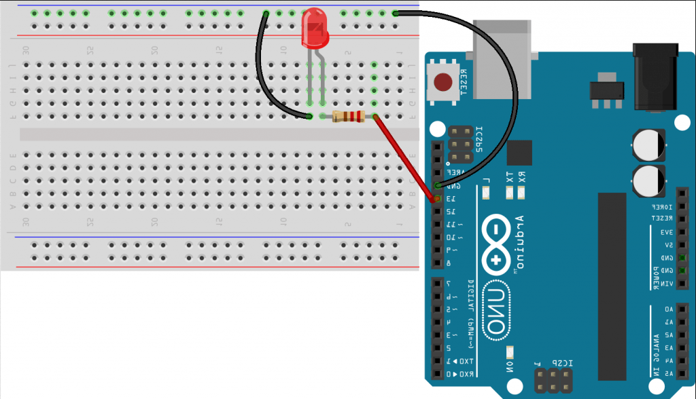

# Arduino-tests
A repository where I shere some of the programs I'm writing to learn arduino.

## Blink

Image from [Fritzing](https://blog.eletrogate.com/arduino-ide-montagem-e-descricao-de-onze-exemplos/)
